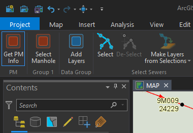
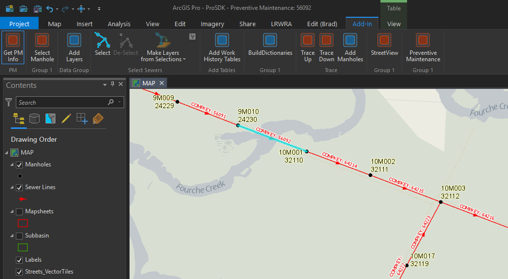
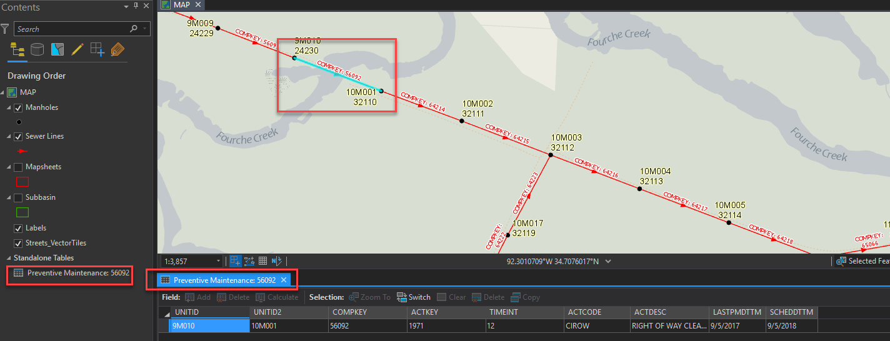

---

---

# ArcGIS-Pro-PreventiveMaintenance
An ArcGIS Pro add-in whereby the User selects a sewer line,  the tool queries for the scheduled preventive maintenance—if there is any—for the selected line, then displays the result in a query table. 

This tool is also apart of the larger [LRWRA add-in](https://github.com/dogwoodgeo/ArcGIS-Pro-LRWRA) 

**Note**: I am a novice .Net developer, at best.  The add-in works, but feel free to let me know if you see any code that is "wrong" or just plain bad.  

## Getting Started

Clone or download the repository. Open Visual Studio 2015 or 2017, build solution, launch ArcGIS Pro and check the **Add-Ins** tab.

### Prerequisites

```
Language:				C#
Contributor:			Bradley Jones, bjones@dogwoodgeo.com
Organization:			Little Rock Water Reclamation Authority (LRWRA)
Org Site: 			    https://gis.lrwu.com/portal
Date:					3/6/2019
ArcGIS Pro:				2.3
ArcGIS Pro SDK: 		2.3
Visual Studio: 			2017, 2015
.NET Target Framework:	4.6.1
```

### How To Use Add-In

1. Build add-in (see **Getting Started**)

2. Launch ArcGIS Pro.

3. Go to **Add-In** tab

4. Activate tool

   

5. Click on the sewer line you wish to get preventive maintenance information for.

   

6. Query table opens with the desired information, if available.

   


